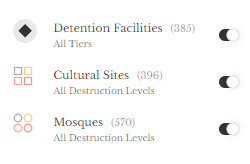
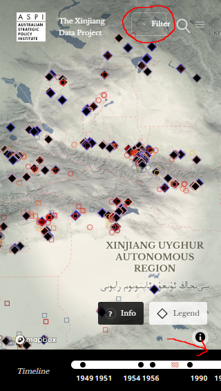
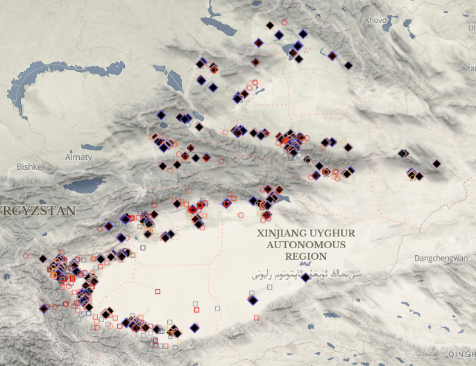

# Xinjiang-Data-Project-Analysis
Essay on the analysis of the Xinjiang Data Project for Geog 458 by Henry Ko

### Link to the Xinjiang Data Project Map
https://xjdp.aspi.org.au/map/

## Final Paper

#### Introduction and General Overview
With the developing human rights catastrophe that is the Chinese government’s continued oppression of the Uyghur people, the Australian Strategic Policy Institute (ASPI) took it upon their own hands to collect data on government activities in Uyghur regions and display it on a mapping project. The ASPI group said that their intention is to show a “set of topics including the mass internment camps, surveillance and emerging technologies, forced labor and supply chains, the ‘re-education’ campaign, deliberate cultural destruction and other human rights abuses” (ASPI, n.d.) of the Chinese government.

ASPI was not, however, alone in the production and maintenance of the project. The group stated that they were initially supported by the United States government’s State Department, though whether that is still the case is unclear as they claimed they are now looking for further funding.  They are also getting support in data collection and general assistance from the Human Rights Watch, Rose-Hulman Institute of Technology, the University of Colorodo Boulder, and an investigative reporter from Axios China. In terms of who the ASPI group are, they are an independent group that investigates different government policies.

ASPI created a webmap using their data and made it an integral part of their project. The map itself has a focus on interactivity and a minimalist design. The map has multiple coordinate points that are color and shape coded to represent the type of compounds in the region. The map has controls allowing users to pan round and zoom into the map with satellite captured imagery. Other than standard map controls in adjusting the map view, ASPI included controls to filter different compound indicators on the map in a selector on the bottom right which also acts as a legend. Additional functionality was seen in the form of the clickable compound icons on the map. When the icons are clicked, they will reveal a sidebar filled with summary information about each compound. ASPI also included a small timeline on the bottom of the map to show major incidents in relation to government actions against the Uyghur people.

There is no particular intended audience, as this project was created to raise awareness of the plight of the Uyghur people and to show people around the world what they are going through. There is no subscription or restriction for the project, so it is fair to say that the intended audience is anybody who is willing to learn more about the situation.

Data used to power the webmap is constantly updated and collected to keep the public informed with the newest, and most accurate information possible. Dates of collection and updates for the data can range all the way from 2013 to 2020. ASPI collects data through “open source data including satellite imagery, Chinese and Uyghur-language documents, official government statistics and a range of authoritative reports and academic studies” (ASPI, n.d.). The project also has a method of collecting directly submitted data on their website.

#### Systematic Architecture
In terms of the tech stack seen in ASPI’s webmap, they appear to have a [Mapbox GL JS](https://docs.mapbox.com/mapbox-gl-js/api/) – a JavaScript Library from Mapbox – powered map using both OpenStreetMap and [Maxar](https://www.maxar.com/) – which deals mostly with satellite captured imagery. While the frameworks they used to create the map itself can be deduced to a certain degree, the same cannot be said for their data flow.

[Data](https://xjdp.aspi.org.au/data/?tab=data) appears to be loaded in the map in the form of JSON files. However, exactly what the JSON files contain or exactly what their purposes are in the map remains unclear. Seeing as they have a lot of calls being rerouted back to the organization’s server, it is possible that they have data stored in privately owned servers. The two ways clients can see the data is either through its display on the webmap, or through a separate dataset link – alternatively called “list mode” on their website.

Figure 1

Functionality of the website does not appear to go any further than the functionalities and interactivity described previously in reference to how the webmap works. The webmap offers interactivity through clickable icons on the map with a box on the bottom right that acts both as a filter and a legend **(Figure 1)**. It should also be mentioned that the website technically offers two filtering options, with one in the aforementioned legend, and the other appearing as a collapsible sidebar triggered by a filter button on the top right corner of the screen. The website also includes a timeline which outlines major events related to the project. Other than general features, the website offers different clickable elements to show more information about the project, as seen in a collapsible side menu and a “Map info” button on the bottom left. Even after examining the viewable source code, there does not appear to be any additional “hidden” functionality.

#### UI/UX Evaluation

Figure 2

There are different things that can be said in terms of the responsive designs of the website. The webmap appears to scale well generally for bigger screens. While testing how well the website scales with computers and tablets, they appeared to function normally. However, the website will need some serious adjustments for their mobile websites **(Figure 2)**. While they do make the legend collapsible, the timeline is not scaled down and some clickable elements require repositioning. It should also be mentioned that, while there is not much that could realistically be done about it, the map looks awfully clustered when viewing it from a mobile device.

Figure 3

While there is nothing inherently wrong with the way the map is displayed, there are a few adjustments that could potentially be applied to help spread out the map's data points and make the clickable features more easily navigable and viewable. The fact that there are a lot of sites in close proximity **(Figure 3)** means the clickable points will be clustered very close together, meaning it may be a little difficult to click the individual icons without zooming in extensively. This can be difficult to do in a smaller device, and the general clutter makes it less readable.

ASPI could potentially use different mapping techniques to optimize their webmap. For example, the developers could combine a choropleth, dot density map, and proportional symbol map. The choropleth aspect of the map can be used to show which subregions suffer more from oppression to help audiences visualize how spread out the offenses are. The proportional symbols could be used if the map is zoomed out too much, eliminating the clustered feel of the dot density map. Users can zoom into the proportional symbols, and when they reach a zoom level where the icons would be less clustered, the map could then reveal the points individually. Something similar can be seen in the [University of Washington’s Humanistic GIS Laboratory (HGIS) Novel Coronavirus map](https://hgis.uw.edu/virus/).

In terms of the basemap the ASPI group decided to use, there does not appear to be any issues with their choice of using [Maxar’s basemap](https://blog.maxar.com/earth-intelligence/2020/mapbox-adds-maxars-vivid-basemap-as-global-foundational-imagery-layer). In fact, using the Maxar basemap was probably the most optimal choice for them. This basemap in particular highlights the landscape and its terrain a lot better than most basemaps available right now. Aside from describing the environment better, Maxar’s basemap is also optimal in that their satellite images are useful to visualize every detention facilities, destroyed cultural sites and Mosques if users decide to zoom into them on the map.

Figure 4

In addition to general design critiques, it is also good to assess the accessibility aspects of design of the map. Using the [WAVE](https://wave.webaim.org/report#/https://xjdp.aspi.org.au/map/?) – Web Accessibility Evaluation Tool – tool to assess the website, it is recommended to create more contrast in the map – particularly, the title of the project **(Figure 4)**. The tool also found that there are missing form labels in the interface, which makes it potentially harder to navigate for people with certain disabilities.

#### Reflections from Course Materials
There can be a lot that can be associated between the assessment results of this web project and insights from course readings or materials. Many observations were already mentioned in the form of map design critiques, and UI/UX critiques, but it is nice to summarize it all and introduce some additional concepts in a standalone manner.

In reference to [*Digital turn, digital geographies*](https://datajournalism.com/read/longreads/putting-data-back-into-context) by James Ash, Rob Kitchin, and Agnieszka Leszczynski, it is important to acknowledge this data project as a form of how digital geographies is turning the discipline of geography and its impacts. With the introduction of a digitized form of geographic narratives and storytelling, portraying more narratives and countermapping has never been more effective. With “the Chinese government denies the existence of human rights abuses in Xinjiang” and “[denying] the existence of the re-education camps for over a year”, according to ASPI, it is imperative to show the rest of the world – and maybe some people who can access the project within China – the truth behind the horrors the Uyghur people are going through today. It would have been much more difficult to directly show the truth behind such horrors without the help of satellite imagery being stored in a webmap project. What if the world had to rely on the Chinese government’s maps and could not identify the truth behind such horrors? It brings up questions brought up in the reading on "exactly whose knowledges are being produced, by and for whom in deployments of and practices with the technology" (Ash et al., 2016). The impacts of web mapping can easily be seen through the immensely powerful story this project tells us.

While the project is overall a strong, and important one for the world, it does have some drawbacks – particularly in its data maintenance and UI/UX. In the reading [*Putting Data Back Into Context*](https://datajournalism.com/read/longreads/putting-data-back-into-context) by Catherine D’Ignazio, the importance of ensuring consistency in datasets was outlined. If the datasets are viewed in “list mode” through the project, there is one major sign of poor data maintenance. The major inconsistency that can be seen is the lack of collection or analysis dates on some of their data points. While this may not be a big deal for some, it could be problematic in making the project seem less credible, or it could create problems for any data analysis should they perform any.

Another reading that could be mentioned is the [Mapbox guide](https://github.com/jakobzhao/geog458/blob/master/weeks/week05/mapbox-design.pdf) on how to design good maps. The guide emphasized the importance of contrast and readability, which for the most part the ASPI project did well on. However, with the issue of the title color having little contrast with the background and having invisible buttons may not have been the best idea for accessibility. The guide also outlined the importance of making sure proximity of map elements is set correctly. To this end, the project could improve on how cluttered their data points are on the map.

#### Conclusion
ASPI’s Xinjiang Data Project is a significant project in the plight of the Uyghur people’s humanitarian crisis. The project has great intentions of showing the truth behind the Chinese government’s activities in violating human rights in Uyghur regions with visual evidence and a solid data set. Their efforts on creating this massive compilation of data and a highly interactive webmap is admirable, and effective on the most part. If they adjust some of their map features to make it more accessible and readable and make their data entries more consistent, their project would be close to perfection. The fight for human rights is a long and hard one, and it is projects like this that are essential to help raise awareness and educate the world about human rights abuses.

#### Citations
1. Ash, J., Kitchin, R., Leszczynski, A. (2016). Digital turn, digital geographies? Progress in Human Geography, 42(1), 25-43. doi:10.1177/0309132516664800
2. D'Ignazio, C. (2019, April 4). Putting data back into context. Retrieved March 11, 2021, from https://datajournalism.com/read/longreads/putting-data-back-into-context
3. Walton, A. L. (n.d.). The Guide to Map Design. Retrieved March 11, 2021, from https://github.com/jakobzhao/geog458/blob/master/weeks/week05/mapbox-design.pdf
4. The Xinjiang Data Project. (n.d.). Retrieved March 11, 2021, from https://xjdp.aspi.org.au/
5. V.	Zhao, B., Xu, F. (n.d.). Novel coronavirus infection map. Retrieved March 11, 2021, from https://hgis.uw.edu/virus/
